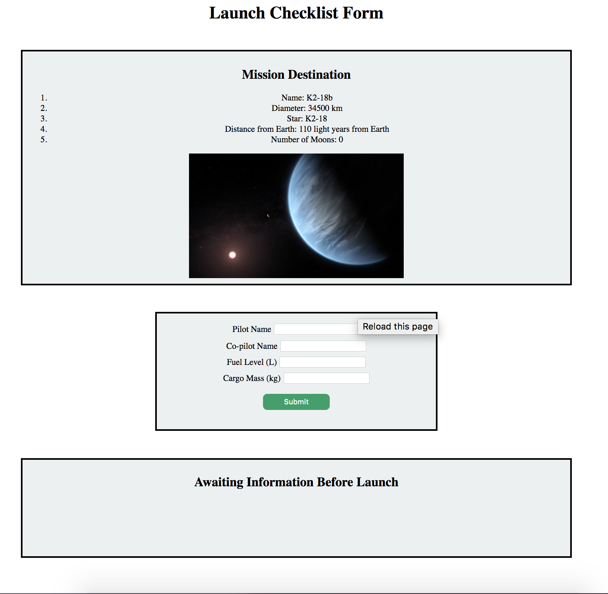

LC101 Graded Assignment #5 Rubric (JS Curriculum)
==================================================

For this "Launch Checklist Form" assignment, the students 
use a form submission and fetch request to accomplish the following:

#. Validate the user responses with preventDefault() to ensure the following: 

   #. The user has entered something for every field.
   #. The user has entered string values for names and number for fuel and cargo levels.

#. With validation, update a list of what is currently ready or not ready for the shuttle launch.
#. Use the DOM to update CSS to indicate what is good and bad about the shuttle and whether it is ready for launch.
#. Fetch some planetary JSON to update the mission destination with vital facts and figures about where the shuttle is headed.

The submitted web page will look similar to the following:

   Example of an initial view of the submitted assignment.

Score your students' work based on the following criteria
----------------------------------------------------------

**Page View:** Does the student's page look similar to the example above?

#. Is the top box populated with the planetary data from the fetch request?
#. On invalid form submission:

   #. Is the form data persistent? The page should not reload here.
   #. Does an alert appear if an empty or partially filled form is submitted? Is the alert message relevant?
   #. Does an alert appear if incorrect data is entered in any field? Names should be strings and fuel and cargo amounts should be numbers.

#. On valid form submission:

   #. Do the pilot and co-pilot values submitted appear as the names in the third box?
   #. Does the fuel value message reflect if the submitted value is too low (less than 10,000) or in the correct range?
   #. Does the cargo value message reflect if the submitted value is too high (more than 10,000) or in the correct range?
   #. Is the header message red and does it read 'Shuttle Not Ready for Launch' when either fuel or cargo are not in range?
   #. Is the header message green and does it read 'Shuttle is Ready for Launch' when both fuel and cargo are submitted in range?

**Code check:** Follow the URL submitted via Canvas to check each student's
work. A quick glance should verify the following:

#. The student added JavaScript in ``script.js`` that is enclosed within a load event listener.
#. A submit event listener handles the form submission.
#. ``event.preventDefault()`` stops the default form submission behavior.
#. Form validation includes logic for incomplete and inappropriate field data types.
#. The list items in the third box use template literals to display submitted values.
#. Status message content and styling changes if the shuttle is ready for launch or not.
#. CSS updates are made via DOM methods. ``styles.css`` remains unchanged.
#. A fetch request hits the `planets api <https://handlers.education.launchcode.org/static/planets.json>`__,
   an item from the response is selected and its values are displayed in the DOM using more template literals.
   In the assignment, students can select whichever planet they want. If they have attempted the bonus mission, then their code is randomly selecting an item from the planets api.

Feedback and Grades
--------------------

If a student's work passes the code check and runs as outlined above in the browser,
assign them a score of 1/1 in Canvas.

As with the previous graded assignments, we encourage you to provide feedback
about your students' code style. The instructions for this assignment are intentionally 
slim. There is little guidance on what to write to meet the requirements and therefore 
students' code quality may benefit from some advice.

If a student's work does not meet one or more of the requirements, 
*provide them with detailed feedback* about which parts need to be improved. 
Be on the lookout for hard-coded data for the mission destination planetary info.

